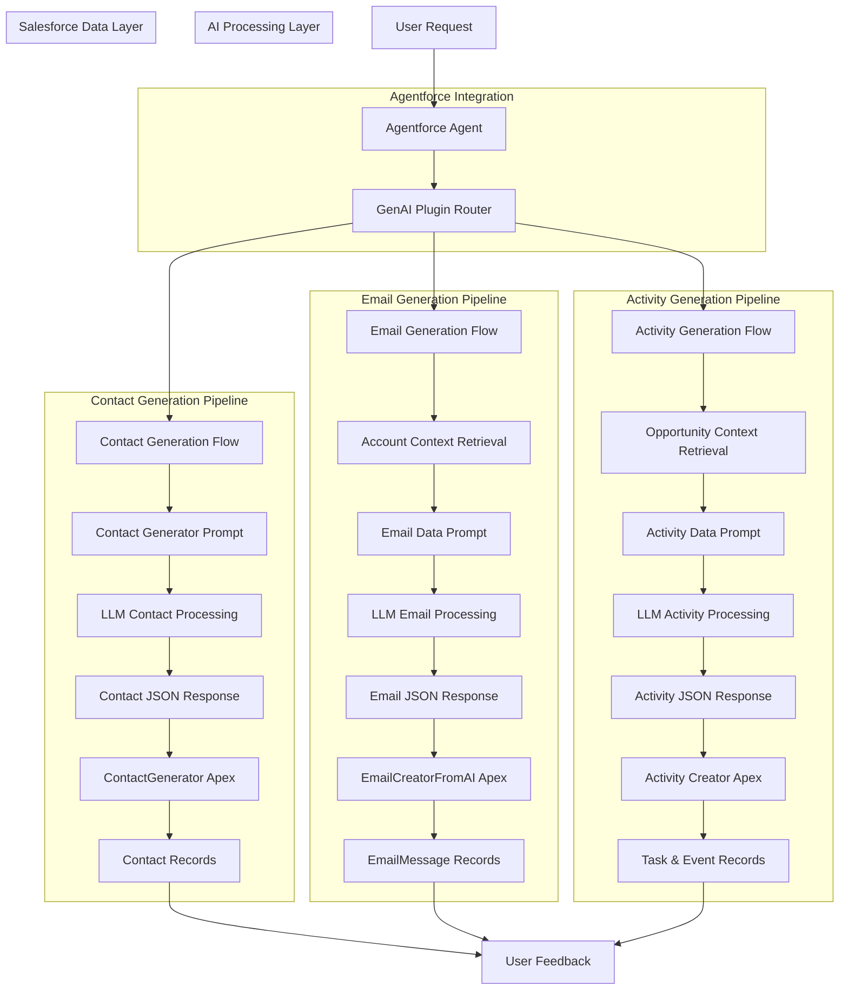

# Mock Data Generator Agent - Complete Architecture & Design

## 🏗️ **System Architecture Overview**

This solution implements a comprehensive AI-powered mock data generation system that integrates with Salesforce Agentforce to create realistic Contact, EmailMessage, Task, and Event records. The architecture follows a modular, event-driven design that leverages multiple Salesforce platform capabilities across three distinct data generation workflows.



## 🧠 **Component Architecture**

### **1. Conversation Interface Layer**
- **Agentforce Agent**: Natural language interface for user interaction across all data types
- **GenAI Plugin Router**: Intelligent routing to appropriate data generation workflows
- **Multi-Modal Request Processing**: Interprets natural language for contacts, emails, and activities

### **2. Contact Generation Pipeline**
- **Contact Generator Flow**: Orchestrates contact creation process
- **Contact Generator Prompt**: AI template for realistic contact data generation
- **ContactGenerator Apex**: JSON parsing and Contact record creation
- **Industry-Aware Generation**: Context-specific contact profiles and roles

### **3. Email Generation Pipeline**
- **AI Email Generator Flow**: Manages email creation workflow
- **Account Context Retrieval**: Fetches business context for AI enhancement
- **Email Data Prompt**: Sophisticated email content and relationship generation
- **EmailCreatorFromAI Apex**: EmailMessage creation with proper threading
- **User Context Integration**: Internal/external email relationship handling

### **4. Activity Generation Pipeline**
- **Activity Generator Flow**: Coordinates Task and Event creation
- **Opportunity Context Retrieval**: Gathers deal-specific metadata
- **Activity Data Prompt**: Generates realistic business activity progressions
- **Activity Creator Apex**: Task and Event record creation with relationships
- **Deal Progression Logic**: Time-based activity sequencing

### **5. AI Processing Layer**
- **Multi-Template System**: Specialized prompts for each data type
- **LLM Integration**: OpenAI GPT-4 Omni model processing across workflows
- **JSON Response Handling**: Structured data format for consistent parsing
- **Context-Aware Generation**: Business-relevant content based on record relationships

### **6. Data Persistence Layer**
- **Contact Object**: Standard Salesforce Contact records with Account relationships
- **EmailMessage Object**: Email storage with proper threading and relationships
- **Task & Event Objects**: Activity tracking with Account/Opportunity linkage
- **Record Relationships**: Comprehensive linking across all generated data
- **Sharing & Security**: Leverages Salesforce security model across all objects

## 🔄 **Data Flow Architecture**

### **Multi-Modal Input Processing**
```
User Natural Language → Intent Classification → Data Type Routing → Context Extraction
```
- **Data Type Detection**: "contacts", "emails", "activities" → Workflow routing
- **Volume Understanding**: "5 contacts", "3 emails", "6 activities" → Count extraction
- **Time Period Parsing**: "last 3 months", "January to June" → Date range calculation
- **Persona Recognition**: "Bobby Gibbs, CEO", "technology industry" → Character/context definition
- **Scenario Mapping**: "B2B deal progression", "customer onboarding" → Business context

### **Contact Generation Flow**
```
Account Context + Industry → Contact Prompt → LLM → Contact JSON → Contact Records
```
- **Industry Contextualization**: Account industry informs realistic job titles and backgrounds
- **Diversity Generation**: Names and backgrounds from varied cultural contexts
- **Professional Hierarchy**: Realistic organizational structures and reporting relationships
- **Contact Data Completeness**: Full contact information with proper address formats

### **Email Generation Flow**
```
Account/User Context + Request → Email Prompt → LLM → Email JSON → EmailMessage Records
```
- **Business Context Integration**: Account/Opportunity details inform email content
- **Realistic Timeline Distribution**: Emails spread across requested timeframe
- **Conversation Coherence**: Sequential emails that tell a cohesive business story
- **Internal/External Routing**: Proper sender/recipient relationships based on user context
- **Thread Management**: Email conversation threading and reply-to linking

### **Activity Generation Flow**
```
Opportunity Context + Request → Activity Prompt → LLM → Activity JSON → Task/Event Records
```
- **Deal Stage Awareness**: Activities reflect realistic sales progression
- **Mixed Activity Types**: Balanced combination of Tasks and Events
- **Chronological Sequencing**: Time-based activity ordering showing business progression
- **Outcome Documentation**: Realistic descriptions and next steps

### **Cross-Pipeline Integration**
```
Generated Contacts ↔ Email Generation ↔ Activity Generation
```
- **Contact-Email Linking**: Generated contacts can be referenced in email generation
- **Activity-Contact Association**: Tasks and Events can reference generated contacts
- **Unified Business Narrative**: All generated data tells a cohesive business story

## 🎯 **Business Logic Architecture**

### **Contact Generation Intelligence**
The system creates realistic contact profiles through:

1. **Industry Contextualization**:
   - Job titles relevant to specific industry sectors
   - Professional backgrounds appropriate for company size and type
   - Realistic reporting structures and organizational hierarchies

2. **Diversity and Inclusion**:
   - Names from varied cultural and ethnic backgrounds
   - Balanced gender representation across roles
   - Diverse geographic locations with proper address formatting

3. **Professional Authenticity**:
   - Email addresses that follow common business patterns
   - Phone numbers in realistic formats
   - Professional descriptions that match role responsibilities

### **Email Content Intelligence**
The system generates contextually appropriate emails based on:

1. **Temporal Logic**: 
   - Distributes emails across specified timeframes
   - Creates realistic gaps between communications
   - Follows natural business communication patterns

2. **Relationship Progression**:
   - Initial outreach and introduction
   - Discovery and needs assessment  
   - Proposal and negotiation phases
   - Decision and implementation stages

3. **Persona Consistency**:
   - Maintains character voice throughout conversations
   - Uses appropriate business titles and company context
   - Reflects realistic decision-making hierarchies

### **Activity Generation Intelligence**
The system creates authentic business activities through:

1. **Deal Progression Logic**:
   - Activities follow realistic sales cycle stages
   - Tasks and Events appropriately distributed over time
   - Proper sequencing from prospecting to close

2. **Activity Type Optimization**:
   - 60% Tasks (calls, follow-ups, internal coordination)
   - 40% Events (meetings, presentations, negotiations)
   - Realistic duration and location details

3. **Business Context Awareness**:
   - Activities reflect industry-specific processes
   - Descriptions include realistic outcomes and next steps
   - Priority and status values align with business urgency

### **Multi-Data Type Architecture**
```
Contact Generation:
├── Industry-Specific Contact (Primary persona)
├── Supporting Contacts (Decision makers, influencers)
├── Contact Relationships (Reporting structures)
└── Contact-to-Account Linking

Email Thread Management:
├── Primary Email (Initial contact)
├── Response Email (Reply with ThreadIdentifier)
├── Follow-up Email (Same thread, incremental story)
└── Resolution Email (Conclusion of conversation)

Activity Progression:
├── Initial Outreach Tasks (Prospecting)
├── Discovery Events (Meetings, calls)
├── Proposal Activities (Presentations, demos)
└── Negotiation Tasks (Contract review, decision)
```

## 🔧 **Technical Architecture Decisions**

### **Why Multiple Specialized Flows Over Single Monolithic Flow?**
- **Separation of Concerns**: Each data type has distinct generation logic and requirements
- **Maintainability**: Easier to debug and modify individual workflows
- **Performance Optimization**: Targeted processing for specific data types
- **Scalability**: Individual flows can be enhanced independently

### **Why Flow Over Pure Apex?**
- **Low-Code Maintenance**: Business users can modify processes without code changes
- **Visual Process Management**: Clear workflow visualization and debugging across all data types
- **Native AI Integration**: Built-in connectors for prompt templates
- **Error Handling**: Declarative exception management with user-friendly messaging

### **Why JSON Over Direct Object Mapping?**
- **Flexibility**: AI can generate variable numbers of records per request across all data types
- **Error Resilience**: Malformed responses don't break entire process
- **Future Extensibility**: Easy to add new properties without code changes
- **Debugging**: Human-readable format for troubleshooting AI responses
- **Cross-Platform Compatibility**: Standard format works across Contact, Email, and Activity generation

### **Why Specialized Prompt Templates Over Generic Templates?**
- **Data Type Optimization**: Each template optimized for specific record types and business logic
- **Context Awareness**: Contact prompts focus on professional profiles, email prompts on communication patterns
- **Quality Assurance**: Specialized prompts generate higher quality, more realistic data
- **Version Control**: Template changes can be managed through metadata independently
- **Governance**: Centralized prompt management with data-type-specific approval workflows

### **Why Apex Classes for JSON Processing?**
- **Type Safety**: Strongly typed classes prevent runtime errors during deserialization
- **Business Logic**: Complex relationship mapping and validation logic
- **Performance**: Efficient bulk processing for multiple records
- **Error Handling**: Granular exception management for different data types

## 📊 **Performance Architecture**

### **Multi-Workflow Scalability Considerations**
- **Parallel Processing**: Multiple data types can be generated simultaneously
- **Batch Processing**: Creates multiple records of each type in single DML operations
- **Governor Limit Awareness**: Each workflow designed within Salesforce execution limits
- **Async Processing**: Individual flows can be enhanced with Platform Events for high-volume scenarios
- **Resource Isolation**: Each data type has independent resource consumption

### **Cross-Pipeline Efficiency Optimizations**
- **Single AI Call Per Data Type**: One prompt generates all requested records of each type
- **Minimal Database Queries**: Efficient record retrieval and creation across all workflows
- **JSON Streaming**: Large datasets processed without memory constraints
- **Context Reuse**: Account/Opportunity context shared across related workflows
- **Intelligent Caching**: Business context cached for related generation requests

### **Data Type Specific Performance**
- **Contact Generation**: Optimized for bulk contact creation with address validation
- **Email Generation**: Thread management and relationship linking optimized for scale
- **Activity Generation**: Chronological ordering and relationship creation optimized

## 🎭 **User Experience Architecture**

### **Multi-Modal Conversation Design**
The system supports natural, conversational requests across all data types:

```
Contact Generation Examples:
├── "Create 5 contacts for this technology account"
├── "Generate diverse contacts in the healthcare industry"
├── "Add 3 executive contacts with realistic backgrounds"
└── "Create contacts for a consulting firm"

Email Generation Examples:
├── "Create 5 emails over 6 months showing deal progression"
├── "Generate customer service emails for this account"  
├── "Add project update emails from January to March"
└── "Create mock emails with Bobby Gibbs interactions"

Activity Generation Examples:
├── "Generate 6 activities showing enterprise deal negotiation"
├── "Create tasks and events for Q4 opportunity progression"
├── "Add meeting activities with key stakeholders"
└── "Show 3 months of deal progression activities"
```

### **Unified Feedback Loop**
```
User Request → Data Type Detection → Processing Indicator → Success/Failure Message → Record Links & Counts
```

### **Cross-Data Type Integration**
```
"Create 3 contacts and 5 emails for this account" → Parallel Processing → Unified Results
```

## 🎯 **Expected Outcomes & Benefits**

### **For Sales Teams**
- **Demo Enhancement**: Complete business context with realistic contacts, email histories, and activity progressions
- **Training Scenarios**: Practice conversations with diverse personas across full sales cycles
- **Pipeline Visualization**: Complete deal progression stories with contacts, communications, and activities
- **Relationship Mapping**: Realistic contact hierarchies and communication patterns

### **For Marketing Teams**
- **Campaign Testing**: Realistic customer journey sequences with contacts and email interactions
- **Content Strategy**: Examples of effective B2B communication patterns across personas
- **Persona Development**: Consistent character interactions with complete contact profiles
- **Journey Mapping**: Full customer lifecycle with touchpoints and activities

### **For Developers**
- **Test Data Generation**: Comprehensive datasets across Contacts, EmailMessages, Tasks, and Events
- **Integration Testing**: Multi-object dependent features with rich, interconnected data
- **Demo Environments**: Compelling showcases with complete business scenarios
- **Performance Testing**: Realistic data volumes across all standard objects

### **For Administrators**
- **User Training**: Realistic Salesforce environments with complete business data
- **Process Testing**: Multi-object automation with authentic scenarios
- **Data Migration**: Template patterns for importing historical business data
- **Security Testing**: Field-level and record-level security across generated data

### **For Business Analysts**
- **Reporting Scenarios**: Rich datasets for dashboard and report development
- **Process Documentation**: Complete business workflows with realistic examples
- **Requirement Validation**: Test scenarios with comprehensive business context

## 🔮 **Extensibility Architecture**

### **Planned Enhancement Points**
1. **Industry-Specific Templates**: Specialized patterns for different business sectors across all data types
2. **Multi-Language Support**: Internationalization of generated content for global scenarios
3. **Advanced Relationship Mapping**: Complex organizational charts and reporting structures
4. **Attachment Generation**: Mock documents and files with emails and activities
5. **Calendar Integration**: Meeting requests and event-driven email sequences
6. **Custom Object Support**: Extension to custom objects beyond standard Salesforce objects
7. **Opportunity Generation**: Full opportunity lifecycle with contacts, activities, and communications
8. **Lead Generation**: Complete lead-to-customer journey scenarios

### **AI Enhancement Opportunities**
1. **Sentiment Analysis**: Emotional tone progression throughout email conversations
2. **Conversation Intelligence**: Advanced dialogue pattern recognition
3. **Predictive Content**: AI-suggested next activities based on historical patterns
4. **Dynamic Persona Evolution**: Character development over time

### **Integration Opportunities**
1. **Einstein Activity Capture**: Sync with real email and activity tracking systems
2. **Marketing Cloud**: Connect with campaign automation and journey builder
3. **Service Cloud**: Generate support case histories with contacts and activities
4. **Experience Cloud**: Create customer portal interaction scenarios
5. **Pardot/Account Engagement**: Marketing qualified lead scenarios with activities
6. **Salesforce CPQ**: Quote and proposal workflows with supporting activities

## 🏆 **Success Metrics**

### **Technical Success Indicators**
- **Response Time**: < 30 seconds for mixed data type generation (5 contacts + 3 emails + 6 activities)
- **Success Rate**: > 95% successful record creation across all data types
- **Data Quality**: AI-generated content passes business review across contacts, emails, and activities
- **Cross-Pipeline Integration**: Seamless data relationships between generated contacts, emails, and activities
- **User Adoption**: Active usage across sales, marketing, and demo scenarios

### **Data Type Specific Metrics**
- **Contact Generation**: > 90% realistic industry-appropriate profiles
- **Email Generation**: > 95% coherent conversation threads with proper relationships
- **Activity Generation**: > 90% realistic business progression sequences

### **Business Value Metrics**
- **Demo Effectiveness**: Improved prospect engagement with comprehensive, realistic business scenarios
- **Training Efficiency**: Faster user onboarding with rich, interconnected example data
- **Development Velocity**: Reduced test data creation time across multiple object types
- **Sales Enablement**: Enhanced storytelling capabilities with complete business context
- **Testing Coverage**: Improved application testing with realistic multi-object scenarios

## 🛡️ **Security Architecture**

### **Multi-Object Data Protection**
- **No External Data**: All generated content stays within Salesforce across all data types
- **Sharing Rules**: Inherits existing Account/Opportunity security for all generated records
- **Field-Level Security**: Respects user permissions across Contact, EmailMessage, Task, and Event fields
- **Record-Level Security**: Generated data follows existing OWD and sharing model
- **Audit Trail**: All generation activities logged through standard Salesforce tracking

### **AI Trust Layer**
- **Content Filtering**: Business-appropriate language generation across all data types
- **Data Masking**: No real customer data exposed to AI models
- **Prompt Injection Protection**: Structured templates prevent malicious input across all workflows
- **Usage Monitoring**: Track AI consumption and costs across contact, email, and activity generation
- **Cross-Pipeline Security**: Consistent security model across all data generation workflows

### **Compliance Considerations**
- **GDPR Compliance**: Generated data can include privacy considerations for contact information
- **Industry Standards**: Healthcare, Financial Services, and other regulated industry templates
- **Data Retention**: Generated data follows standard Salesforce retention policies

## 🎯 **Implementation Components**

### **Core Salesforce Metadata**
```
force-app/main/default/
├── flows/
│   ├── Contact_Generator_Flow.flow-meta.xml
│   └── AI_Email_Generator.flow-meta.xml
├── classes/
│   ├── ContactGenerator.cls
│   └── EmailCreatorFromAI.cls
├── genAiPromptTemplates/
│   ├── Contact_Generator.genAiPromptTemplate-meta.xml
│   ├── Generate_Email_Data_From_Request.genAiPromptTemplate-meta.xml
│   └── Generate_Mock_Activity_Data.genAiPromptTemplate-meta.xml
└── genAiPlugins/
    ├── Mock_Contact_Generation.genAiPlugin-meta.xml
    ├── Mock_Email_Generation.genAiPlugin-meta.xml
    └── RFP_Analysis.genAiPlugin-meta.xml
```

### **Data Generation Capabilities**
- **Contact Generation**: Realistic professional profiles with industry-specific roles
- **Email Generation**: Coherent business communication threads with proper relationships
- **Activity Generation**: Deal progression sequences with Tasks and Events
- **Cross-Object Integration**: Unified business narratives across all generated data

## 🚀 **Conclusion**

This comprehensive Mock Data Generator Agent architecture delivers a robust, scalable solution that transforms simple natural language requests into rich, contextual mock data across multiple Salesforce objects. The system enhances demonstrations, training, and testing scenarios by providing:

- **Complete Business Context**: Contacts, communications, and activities that tell coherent business stories
- **Industry Awareness**: Content appropriate for specific business sectors and use cases  
- **Scalable Architecture**: Modular design that can be extended to additional objects and use cases
- **AI-Powered Intelligence**: Sophisticated content generation that creates realistic, professional data
- **Salesforce Native**: Leverages platform capabilities for security, performance, and maintainability

The agent empowers teams across sales, marketing, development, and administration to work with realistic, comprehensive datasets that reflect authentic business scenarios, ultimately improving productivity and user experience across the Salesforce ecosystem.